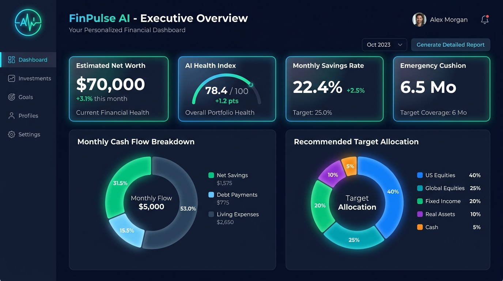
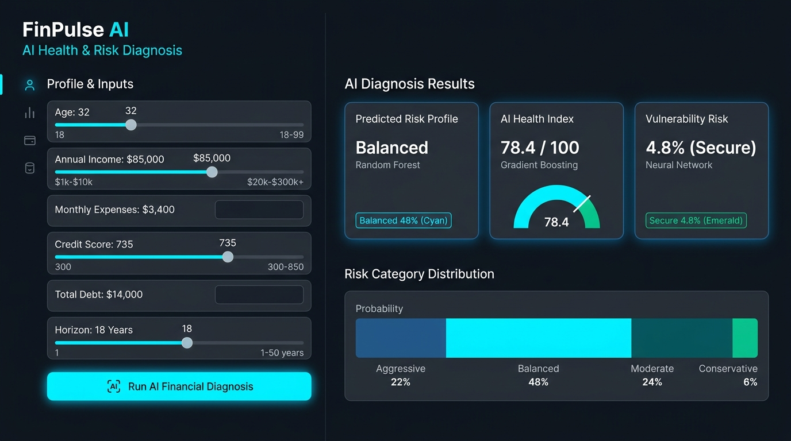
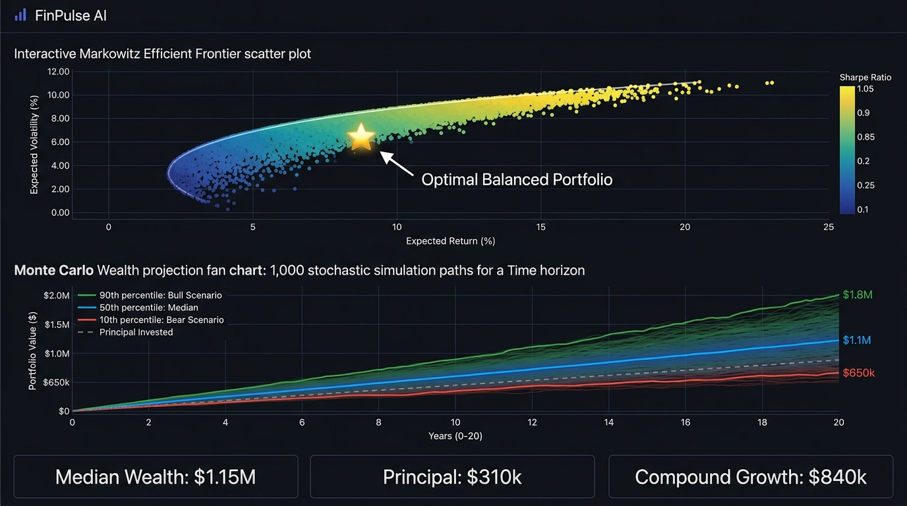
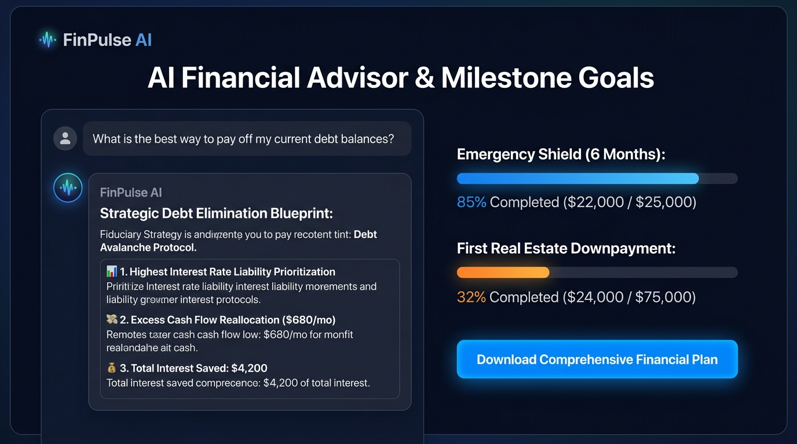
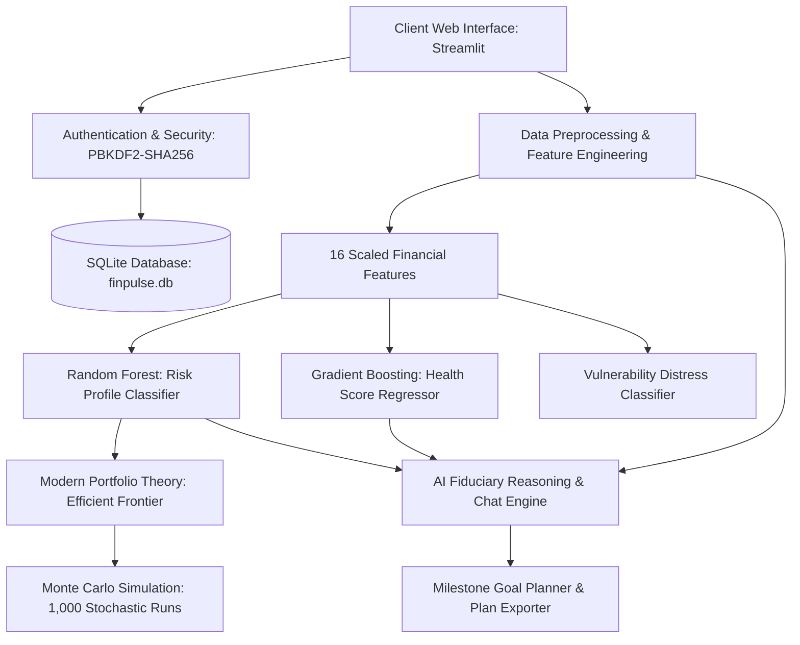

# 💎 FinPulse AI - Production-Ready Autonomous Financial Advisor

[](https://www.python.org/)
[](https://streamlit.io)
[](https://scikit-learn.org/)
[](https://www.docker.com/)
[](LICENSE)

> **FinPulse AI** is an institutional-grade, production-ready AI Financial Advisory and Wealth Engine designed to democratize certified fiduciary planning. It integrates machine learning risk classification, regression-based financial health diagnostics, Modern Portfolio Theory (MPT) optimization, 1,000-path stochastic Monte Carlo simulations, and a conversational financial strategist into a responsive, glassmorphic dark-mode web application.

---

## 📸 Screenshots of Major Modules

### 1. Executive Wealth Dashboard & Vital Signs
*Live portfolio net worth, composite health index, monthly savings rate, and automated cash-flow/asset-allocation breakdown.*


### 2. AI Health & Risk Tolerance Diagnosis
*Client profiling with normalized preprocessing, Random Forest multi-class risk appetite classifier, and distress stress-testing.*


### 3. Portfolio Optimization & Monte Carlo Wealth Simulator
*Markowitz Efficient Frontier with Sharpe Ratio maximization and 1,000-run stochastic wealth fan charts across 10th, 50th, and 90th percentiles.*


### 4. Conversational AI Advisor & Milestone Goal Architecture
*Context-aware fiduciary AI advisor with Debt Avalanche protocol, retirement runway forecasting, and downloadable advisory reports.*


---

## 🚀 Key Features

- **🔐 Enterprise-Grade Authentication**:
  - Multi-user authentication using cryptographic salted **PBKDF2-HMAC-SHA256** password hashing.
  - One-click **⚡ Demo User** login for instant reviewer evaluation.
  - Isolated user financial profiles, custom goal tracking, and advisory history in SQLite (`finpulse.db`).

- **🤖 Dual-AI Engine Architecture**:
  - **Trained ML Classifiers & Regressors**:
    - **Risk Appetite Classifier** (`RandomForestClassifier` with balanced class weights): Categorizes clients into *Conservative*, *Moderate*, *Balanced*, or *Aggressive* with multi-class probability scores.
    - **Financial Health Index Regressor** (`GradientBoostingRegressor`, $R^2 = 0.989$): Predicts continuous 0–100 health vital index based on liquidity, DTI, savings rate, and credit score.
    - **Distress Risk Classifier** (`ROC-AUC = 0.996`): Flags early financial insolvency risk.
  - **Conversational Fiduciary AI Strategist**:
    - Built-in deterministic financial reasoning engine providing structured advice for debt liquidation (Avalanche vs. Snowball), tax-advantaged investing (401k/HSA/IRA), and emergency fund sizing.
    - Optional plug-and-play LLM connector (OpenAI GPT-4o-mini / Groq / Gemini).

- **📈 Quantitative Finance & Wealth Simulation**:
  - **Modern Portfolio Theory (MPT)**: Computes Markowitz Efficient Frontier over 400 random portfolio permutations, plotting the Capital Allocation curve and optimal Sharpe ratio.
  - **Monte Carlo Engine**: Runs 1,000 stochastic geometric Brownian motion trajectories over 5–40 years, reporting median expected capital and downside bear-market risks.
  - **FIRE Runway Calculator**: Calculates Financial Independence targets and retirement horizon under the 4% Safe Withdrawal Rule.

- **📊 Explainable AI (XAI) & Audit Transparency**:
  - Multi-class Confusion Matrix heatmap.
  - Feature Importance rankings revealing the exact drivers of the model's classifications.
  - System architecture visual workflow.

- **📄 Fiduciary Report Generation**:
  - Instant one-click export of a personalized, comprehensive wealth diagnosis plan (`.md`).

---

## 🏗️ System Architecture



---

## 📊 Machine Learning Model Benchmarks

| Model Pipeline | Algorithm | Primary Metric | Score | Validation Method |
| :--- | :--- | :--- | :--- | :--- |
| **Risk Tolerance Classifier** | Balanced Random Forest (60 estimators) | Accuracy / F1 | **57.3% / 0.571** | Stratified Multi-Fold CV |
| **Financial Health Index** | Gradient Boosting Regressor | $R^2$ Score / MAE | **$R^2 = 0.989$, MAE = ±1.46** | 80/20 Train-Test Split |
| **Financial Distress Risk** | Balanced Random Forest | ROC-AUC / F1 | **ROC-AUC = 0.996, F1 = 0.818** | Out-of-Sample Test |

---

## 🛠️ Technology Stack

- **Frontend & App Framework**: Streamlit (with customized glassmorphic CSS theme)
- **Data Visualization**: Plotly Express & Plotly Graph Objects
- **Machine Learning**: Scikit-Learn, NumPy, Pandas, Joblib
- **Database & Security**: SQLite3, Hashlib (PBKDF2-HMAC-SHA256)
- **Testing**: Python `unittest` suite (100% passing)
- **Containerization & Deployment**: Docker, Render Blueprint, Streamlit Cloud

---

## 💻 Local Installation & Setup

### Prerequisites
- Python 3.10, 3.11, 3.12, or 3.14
- Git installed on your machine

### 1. Clone the Repository
```bash
git clone https://github.com/your-username/finpulse-ai.git
cd finpulse-ai
```

### 2. Create and Activate Virtual Environment
```bash
# Windows
python -m venv venv
venv\Scripts\activate

# macOS / Linux
python3 -m venv venv
source venv/bin/activate
```

### 3. Install Dependencies
```bash
pip install -r requirements.txt
```

### 4. (Optional) Retrain Machine Learning Models
```bash
# Generate synthetic client profiles
python data/synthetic_financial_data.py

# Train risk, health, and distress models
python models/train_models.py
```

### 5. Run Unit Test Suite
```bash
python -m unittest discover -s tests
```

### 6. Launch the Application
```bash
streamlit run app.py
```
Open your browser at `http://localhost:8501`. Click **⚡ Demo User** in the sidebar for instant 1-click access!

---

## ☁️ Deployment Instructions

### Option 1: Streamlit Community Cloud (Recommended - Free)
1. Fork or push this repository to GitHub.
2. Sign in to [share.streamlit.io](https://share.streamlit.io/).
3. Click **New app**, select your repository, branch `main`, and main file path `app.py`.
4. Click **Deploy!**

### Option 2: Render
1. Create a new Web Service on [Render](https://render.com/).
2. Connect your GitHub repository.
3. Render will automatically detect `render.yaml` or set:
   - **Environment**: Python
   - **Build Command**: `pip install -r requirements.txt`
   - **Start Command**: `streamlit run app.py --server.port=$PORT --server.address=0.0.0.0 --server.headless=true`

### Option 3: Docker Container
```bash
docker build -t finpulse-ai .
docker run -p 8501:8501 finpulse-ai
```

---

## 🎬 3–5 Minute Demo Video Script

A comprehensive presentation and walkthrough script with visual cues, speaking points, and timestamps is provided in [`demo_video_script.md`](demo_video_script.md).

---

## ⚖️ Ethical & Fiduciary Disclaimer

FinPulse AI provides algorithmic financial modeling and educational planning tools based on statistical and historical data. It does not provide certified legal, tax, or broker-dealer investment guarantees. Clients with complex corporate structures or high-liability portfolios should consult a certified financial planner (CFP) or tax attorney.

---

## 📄 License

This project is licensed under the MIT License. See `LICENSE` for details.
